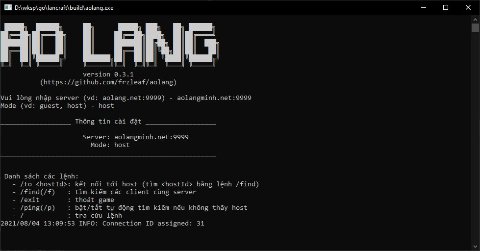

# Ao làng

Chơi LAN game qua internet




### I. Cài đặt

### 1. Server

Nếu bạn chưa có server thì có thể tải [file binary](https://github.com/frzleaf/aolang/releases)
hoặc clone source code về để build như sau:

*Linux*
```
git clone https://github.com/frzleaf/aolang
cd aolang
export GOPATH=$GOPATH:$PWD
go build -o build/aolang_server src/main/proxy_server.go
```

*Windows*
```
git clone https://github.com/frzleaf/aolang
cd aolang
set GOPATH=%GOPATH%;%cd%
go build -o build/aolang_server.exe src/main/proxy_server.go
```
Chạy máy chủ aolang:
```
// Tạo TCP server với địa chỉ: aolangminh.com:9999
./build/aolang_server aolangminh.com:9999 // linux
./build/aolang_server.exe aolangminh.com:9999 // windows
```

### 2. Client

Vào mục [release](https://github.com/frzleaf/aolang/releases) để tìm bản hỗ trợ cho máy của bạn
hoặc build từ file ```src/main/proxy_client.go```


## II. Các game hỗ trợ

### 1. Warcraft
Các phiên bản warcraft đã thử nghiệm: 1.24e

###2. AOE (sắp tới)
